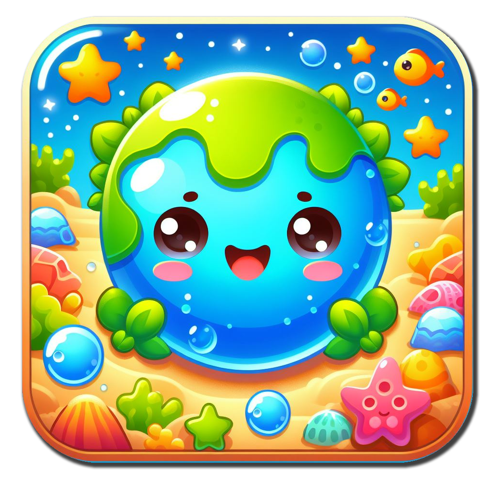

  

 

 

# Save The Ocean

Dive into 'Save The Ocean', a game where you clean the ocean floor, raising awareness about climate change. Save the planet, one dive at a time!

# Project Story

### Inspiration
The inspiration behind "Save The Ocean" stems from our commitment to raising awareness about climate change and its connection to ocean pollution. We aim to empower users to take action through an engaging gaming experience.

### What it does
"Save The Ocean" is a Flutter-based game, utilizing Flame for cross-platform compatibility. Players embark on a mission to clean the ocean floor, promoting environmental consciousness and highlighting the crucial link between climate change and ocean pollution.

### How we built it
We utilized Flutter for cross-platform development, Flame for game development, Rive for animations, and Firebase for backend support. This powerful combination allowed us to create a seamless and engaging gaming experience on various devices.

### Challenges we ran into
Navigating the complexities of game development posed challenges, especially in optimizing performance across various platforms. Balancing educational elements with entertaining gameplay was a key consideration.

### Accomplishments that we're proud of
We take pride in creating a compelling gaming experience that not only entertains but also educates players about environmental issues. The seamless integration of Flutter and Flame allowed us to deliver a polished, cross-platform product.

### What we learned
The project provided valuable insights into optimizing game performance, balancing educational content, and leveraging Flutter and Flame for efficient cross-platform development.

### What's next for Save The Ocean
The journey doesn't end here! We plan to expand "Save The Ocean" by incorporating new levels, challenges, and educational content. Additionally, we aim to collaborate with environmental organizations to further amplify our impact in promoting ocean conservation and climate awareness.

# Demo

[Demo Video](https://youtu.be/S198nXW2O_E)

# MIT LICENSE

Copyright (c) 2024 MTC - More Than Code

Permission is hereby granted, free of charge, to any person obtaining a copy
of this software and associated documentation files (the "Software"), to deal
in the Software without restriction, including without limitation the rights
to use, copy, modify, merge, publish, distribute, sublicense, and/or sell
copies of the Software, and to permit persons to whom the Software is
furnished to do so, subject to the following conditions:

The above copyright notice and this permission notice shall be included in all
copies or substantial portions of the Software.

THE SOFTWARE IS PROVIDED "AS IS", WITHOUT WARRANTY OF ANY KIND, EXPRESS OR
IMPLIED, INCLUDING BUT NOT LIMITED TO THE WARRANTIES OF MERCHANTABILITY,
FITNESS FOR A PARTICULAR PURPOSE AND NONINFRINGEMENT. IN NO EVENT SHALL THE
AUTHORS OR COPYRIGHT HOLDERS BE LIABLE FOR ANY CLAIM, DAMAGES OR OTHER
LIABILITY, WHETHER IN AN ACTION OF CONTRACT, TORT OR OTHERWISE, ARISING FROM,
OUT OF OR IN CONNECTION WITH THE SOFTWARE OR THE USE OR OTHER DEALINGS IN THE
SOFTWARE.
